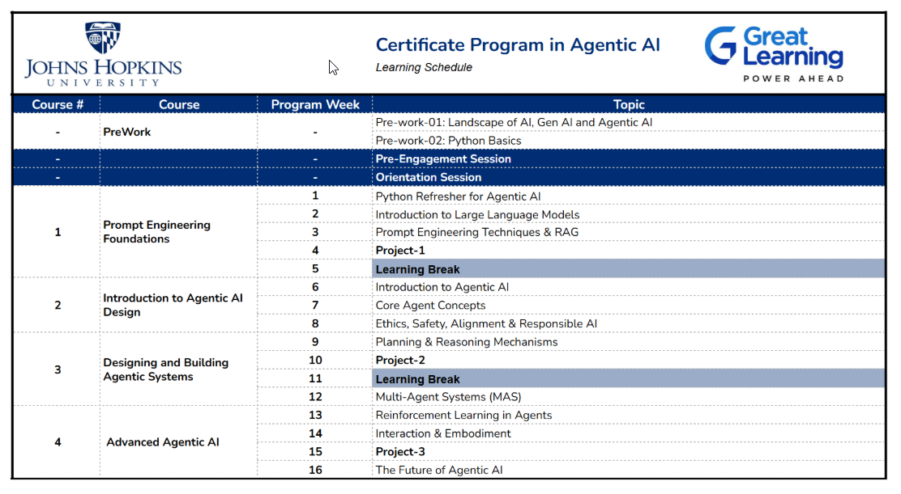

Introduction

Welcome to the 16 Week learning journey of JHU Agentic AI Program! This program is designed to immerse you in a structured, weekly learning rhythm that balances theory, practical skills, and real-world applications, all aimed at making you confident and proficient in Agentic AI. Over the next few weeks, you’ll progress from a recap of Python programming to large language models, advanced techniques in prompt engineering and retrieval-augmented generation, and core concepts of agentic AI, culminating in building and designing autonomous and advanced agentic AI systems for diverse business scenarios.

Let’s dive in, embrace the rhythm, and make this journey into the world of Agentic AI an exciting, transformative experience.

 

Learning Outcomes

Understand the Foundations of Agentic AI
Develop Proficiency in Python for AI Applications
Implement Prompt Engineering & RAG Techniques
Design and Construct Agentic Systems
Evaluate Ethical and Safety Considerations in AI Design
Build Single-Agent and Multi-Agent Systems 
Implement Advanced Learning Paradigms in AI Agents
Explore Human-Agent Interaction Principles
Critically Assess Limitations and Future Directions of Agentic AI
Build Real-World Applications Using Agentic AI Frameworks

